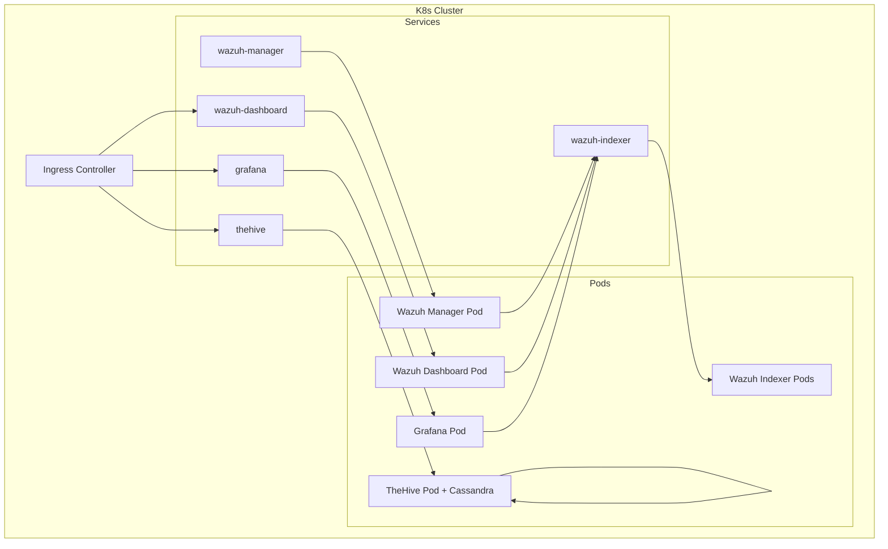

# Phase 1 — Infrastructure Setup (Kubernetes)

## What Is This Phase?

This phase sets up the **entire SOC platform infrastructure** on Kubernetes (K8s). Instead of Docker Compose, we will use **Manifests** (YAML files) to deploy Wazuh, TheHive, and Grafana as scalable, self-healing services.

## Why Are We Implementing This?

| Reason | Explanation |
|---|---|
| **Industry Standard** | Modern SOCs run on K8s for high availability and auto-scaling |
| **Self-Healing** | K8s automatically restarts crashed pods (e.g., if Wazuh manager fails) |
| **Scalability** | Need more power? `kubectl scale deployment wazuh-indexer --replicas=3` |
| **Networking** | Advanced service discovery and ingress control |
| **Interview Value** | Demonstrating K8s proficiency puts you in the top 5% of SOC engineering candidates |

## Architecture Overview



## How to Implement

### Step 1 — Prerequisites

- **Tools:** `kubectl`, `helm` (optional but recommended for Wazuh), `minikube` or `kind` (for local labs)
- **Resources:** Ensure your cluster has at least **8GB RAM** and **4 vCPUs** allocated.

### Step 2 — Namespace & Secrets

Create a dedicated namespace and store secrets:

```bash
kubectl create namespace soc

kubectl create secret generic wazuh-secrets \
  --from-literal=index-password='SecretPassword123!' \
  --from-literal=api-password='SecretAPI!Pass' \
  -n soc
```

### Step 3 — Wazuh Manifests

We'll deploy Wazuh using a **StatefulSet** for the indexer (database) and manager.

**`wazuh-indexer.yaml` (Simplified):**
```yaml
apiVersion: apps/v1
kind: StatefulSet
metadata:
  name: wazuh-indexer
  namespace: soc
spec:
  serviceName: wazuh-indexer
  replicas: 1
  selector:
    matchLabels:
      app: wazuh-indexer
  template:
    metadata:
      labels:
        app: wazuh-indexer
    spec:
      containers:
      - name: wazuh-indexer
        image: wazuh/wazuh-indexer:4.9.0
        env:
        - name: OPENSEARCH_JAVA_OPTS
          value: "-Xms1g -Xmx1g"
        ports:
        - containerPort: 9200
```

**`wazuh-manager.yaml`:**
```yaml
apiVersion: apps/v1
kind: Deployment
metadata:
  name: wazuh-manager
  namespace: soc
spec:
  replicas: 1
  selector:
    matchLabels:
      app: wazuh-manager
  template:
    metadata:
      labels:
        app: wazuh-manager
    spec:
      containers:
      - name: wazuh-manager
        image: wazuh/wazuh-manager:4.9.0
        ports:
        - containerPort: 1514
          name: agents-tcp
        - containerPort: 1515
          name: enrollment
        - containerPort: 55000
          name: api
```

**`wazuh-dashboard.yaml`:**
```yaml
apiVersion: apps/v1
kind: Deployment
metadata:
  name: wazuh-dashboard
  namespace: soc
spec:
  replicas: 1
  selector:
    matchLabels:
      app: wazuh-dashboard
  template:
    metadata:
      labels:
        app: wazuh-dashboard
    spec:
      containers:
      - name: wazuh-dashboard
        image: wazuh/wazuh-dashboard:4.9.0
        env:
        - name: WAZUH_API_URL
          value: "https://wazuh-manager:55000"
        ports:
        - containerPort: 5601
```

### Step 4 — TheHive & Cassandra

For a lab, we'll deploy Cassandra and TheHive in the same pod (sidecar pattern) or separate pods. Best practice is separate Deployment for Cassandra.

**`cassandra.yaml`:**
```yaml
apiVersion: apps/v1
kind: StatefulSet
metadata:
  name: cassandra
  namespace: soc
spec:
  serviceName: cassandra
  replicas: 1
  selector:
    matchLabels:
      app: cassandra
  template:
    metadata:
      labels:
        app: cassandra
    spec:
      containers:
      - name: cassandra
        image: cassandra:4.0
        ports:
        - containerPort: 9042
```

**`thehive.yaml`:**
```yaml
apiVersion: apps/v1
kind: Deployment
metadata:
  name: thehive
  namespace: soc
spec:
  replicas: 1
  selector:
    matchLabels:
      app: thehive
  template:
    metadata:
      labels:
        app: thehive
    spec:
      containers:
      - name: thehive
        image: thehiveproject/thehive:5.2
        env:
        - name: CASSANDRA_ADDRESS
          value: "cassandra.soc.svc.cluster.local"
        ports:
        - containerPort: 9000
```

### Step 5 — Services & Networking

Expose services using `NodePort` or `LoadBalancer`.

```yaml
apiVersion: v1
kind: Service
metadata:
  name: wazuh-dashboard-svc
  namespace: soc
spec:
  type: NodePort
  ports:
  - port: 443
    targetPort: 5601
    nodePort: 30443
  selector:
    app: wazuh-dashboard
```

### Step 6 — Deployment Commands

```bash
# Apply namespace
kubectl apply -f namespace.yaml
kubectl apply -f secrets.yaml

# Apply storage (PersistentVolumes) not shown here but required for statefulsets

# Apply Wazuh Stack
kubectl apply -f wazuh-indexer.yaml
kubectl apply -f wazuh-manager.yaml
kubectl apply -f wazuh-dashboard.yaml

# Apply TheHive
kubectl apply -f cassandra.yaml
kubectl apply -f thehive.yaml

# Check status
kubectl get pods -n soc -w
```

## Common Issues

| Issue | Cause | Fix |
|---|---|---|
| `CrashLoopBackOff` | OOMKilled (Out of Memory) | Increase Docker/Minikube RAM limits (Wazuh loves RAM) |
| Pod Pending | PVC not bound | Check StorageClass (`kubectl get sc`) |
| Service Unreachable | Wrong Selector | Check labels match in Service and Deployment |
| Agent Can't Connect | NodePort vs ClusterIP | Agents outside cluster need NodePort/LoadBalancer IP |

## What Success Looks Like

- ✅ `kubectl get pods -n soc` shows all pods **Running**
- ✅ Access Dashboard at `https://<minikube-ip>:30443`
- ✅ Access TheHive at `http://<minikube-ip>:30900`
- ✅ Wazuh Manager is accepting agent connections on port 31514 (NodePort)

## What's Next?

→ **Phase 2** — We'll point agents to our new Kubernetes Cluster IP/NodePort and ingest logs.
