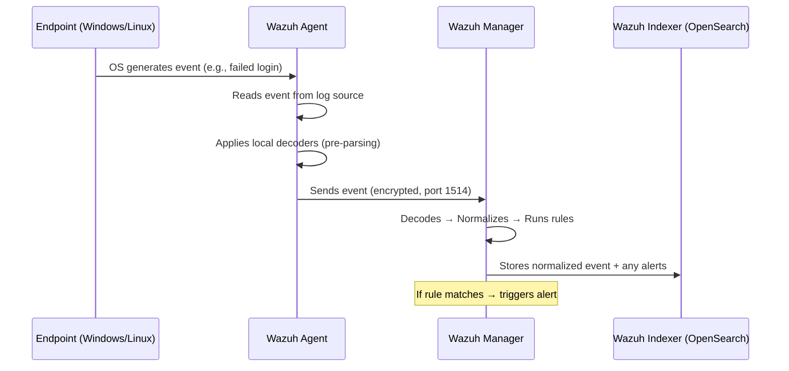

# Phase 2 — Log Ingestion & Normalization

## What Is This Phase?

This phase gets **real security logs flowing** into your Wazuh SIEM from Windows and Linux endpoints. You'll install Wazuh agents on endpoints, configure which logs to collect, and normalize them into a consistent format so detection rules work across all log sources.

## Why Are We Implementing This?

| Reason | Explanation |
|---|---|
| **No logs = blind SOC** | A SIEM without data is useless. Logs are the raw material for all threat detection |
| **Normalization** | Windows logs and Linux logs look completely different. Normalization maps them to a common schema so one rule can detect threats across both |
| **Visibility** | You need to see authentication events, process execution, network connections, and file changes to detect attacks |
| **Compliance** | Standards like PCI-DSS, HIPAA, and SOX require centralized log collection |
| **Interview talking point** | Shows you understand the log pipeline — collection, transport, parsing, normalization, storage |

> **Real-world context:** Enterprise SOCs typically ingest 5,000–50,000+ EPS (Events Per Second). Your lab will handle 10–100 EPS, but the architecture is the same.

## What Logs Are We Collecting?

### Windows Events (Critical Security Logs)

| Event ID | What It Captures | MITRE Relevance | Why It Matters |
|---|---|---|---|
| **4624** | Successful logon | T1078 (Valid Accounts) | Tracks who logged in and how |
| **4625** | Failed logon | T1110 (Brute Force) | Detects password guessing attacks |
| **4688** | New process created | T1059 (Command Execution) | Catches malicious programs running |
| **4720** | User account created | T1136 (Create Account) | Detects attacker creating backdoor accounts |
| **4732** | User added to admin group | T1098 (Account Manipulation) | Privilege escalation indicator |
| **7045** | Service installed | T1543 (Create Service) | Malware often installs as a service |
| **1102** | Audit log cleared | T1070 (Indicator Removal) | Attackers cover tracks by clearing logs |
| **4104** | PowerShell script block | T1059.001 (PowerShell) | Captures actual PowerShell commands |

### Linux Syslog (Critical Security Logs)

| Log Source | What It Captures | MITRE Relevance | Why It Matters |
|---|---|---|---|
| `/var/log/auth.log` | SSH logins, sudo usage | T1021 (Remote Services) | Tracks remote access attempts |
| `/var/log/syslog` | System events, services | T1543 (System Services) | Detects system-level changes |
| `/var/log/audit/audit.log` | Kernel-level events | T1068 (Exploitation) | Deep OS-level visibility |
| Process execution | Commands run on system | T1059 (Command Execution) | Catches malicious commands |
| File integrity | File changes in critical dirs | T1565 (Data Manipulation) | Detects unauthorized file modifications |

## How Wazuh Log Collection Works



**Key concepts:**

1. **Agent** — Lightweight process running on each endpoint. Reads logs and sends them to the manager
2. **Decoder** — Extracts fields from raw log text (e.g., pulls out username, IP, event ID)
3. **Normalization** — Maps extracted fields to a standard schema
4. **Rule** — Logic that checks normalized events for threats (covered in Phase 3)

## How to Implement

### Step 1 — Enable Advanced Windows Audit Policies

Before installing the agent, enable the right audit policies on Windows:

```powershell
# Run as Administrator on the Windows endpoint

# Enable process creation auditing (Event ID 4688)
auditpol /set /subcategory:"Process Creation" /success:enable /failure:enable

# Enable logon auditing (Event IDs 4624, 4625)
auditpol /set /subcategory:"Logon" /success:enable /failure:enable

# Enable account management (Event IDs 4720, 4732)
auditpol /set /subcategory:"User Account Management" /success:enable /failure:enable

# Enable PowerShell Script Block Logging
New-ItemProperty -Path "HKLM:\SOFTWARE\Policies\Microsoft\Windows\PowerShell\ScriptBlockLogging" `
    -Name "EnableScriptBlockLogging" -Value 1 -PropertyType DWord -Force

# Enable command-line in process creation events
New-ItemProperty -Path "HKLM:\SOFTWARE\Microsoft\Windows\CurrentVersion\Policies\System\Audit" `
    -Name "ProcessCreationIncludeCmdLine_Enabled" -Value 1 -PropertyType DWord -Force
```

**Why:** Windows doesn't log most security events by default. Without enabling these policies, you're blind to process creation, PowerShell execution, and account changes.

### Step 2 — Install Wazuh Agent (Windows)

```powershell
# Download and install Wazuh agent
Invoke-WebRequest -Uri https://packages.wazuh.com/4.x/windows/wazuh-agent-4.9.0-1.msi -OutFile wazuh-agent.msi

# Install with LoadBalancer or NodePort IP
# If using NodePort, use port 31514 (default map)
msiexec.exe /i wazuh-agent.msi /q WAZUH_MANAGER="<K8S_NODE_IP>" WAZUH_REGISTRATION_SERVER="<K8S_NODE_IP>" WAZUH_PROTOCOL="TCP" WAZUH_PORT="31514"

# Start the agent service
NET START Wazuh
```

### Step 3 — Install Wazuh Agent (Linux)

```bash
# Add Wazuh repository
curl -s https://packages.wazuh.com/key/GPG-KEY-WAZUH | sudo gpg --no-default-keyring --keyring gnupg-ring:/usr/share/keyrings/wazuh.gpg --import && sudo chmod 644 /usr/share/keyrings/wazuh.gpg

# Install agent
sudo apt-get install wazuh-agent

# Configure manager address
# Configure manager address (NodePort example)
sudo sed -i 's/MANAGER_IP/<K8S_NODE_IP>/' /var/ossec/etc/ossec.conf
# Also update port if using NodePort
# <port>31514</port>

# Start agent
sudo systemctl start wazuh-agent
sudo systemctl enable wazuh-agent
```

### Step 4 — Configure Agent Log Collection

The Wazuh agent config (`ossec.conf`) defines what to collect:

**Windows Agent — Key Configuration Sections:**

```xml
<ossec_config>
  <!-- Windows Event Channels -->
  <localfile>
    <location>Security</location>
    <log_format>eventchannel</log_format>
    <query>Event/System[EventID=4624 or EventID=4625 or EventID=4688 
           or EventID=4720 or EventID=4732 or EventID=7045 or EventID=1102]</query>
  </localfile>

  <!-- PowerShell Operational Logs -->
  <localfile>
    <location>Microsoft-Windows-PowerShell/Operational</location>
    <log_format>eventchannel</log_format>
  </localfile>

  <!-- Sysmon (if installed — highly recommended) -->
  <localfile>
    <location>Microsoft-Windows-Sysmon/Operational</location>
    <log_format>eventchannel</log_format>
  </localfile>

  <!-- File Integrity Monitoring -->
  <syscheck>
    <directories check_all="yes" realtime="yes">C:\Windows\System32</directories>
    <directories check_all="yes" realtime="yes">C:\Users\*\AppData\Roaming</directories>
  </syscheck>
</ossec_config>
```

**Linux Agent — Key Configuration Sections:**

```xml
<ossec_config>
  <!-- Authentication logs -->
  <localfile>
    <log_format>syslog</log_format>
    <location>/var/log/auth.log</location>
  </localfile>

  <!-- System logs -->
  <localfile>
    <log_format>syslog</log_format>
    <location>/var/log/syslog</location>
  </localfile>

  <!-- Audit logs -->
  <localfile>
    <log_format>audit</log_format>
    <location>/var/log/audit/audit.log</location>
  </localfile>

  <!-- File Integrity Monitoring -->
  <syscheck>
    <directories check_all="yes" realtime="yes">/etc</directories>
    <directories check_all="yes" realtime="yes">/usr/bin</directories>
    <directories check_all="yes" realtime="yes">/usr/sbin</directories>
  </syscheck>
</ossec_config>
```

### Step 5 — Understand Normalization (Decoders)

When a raw log arrives, Wazuh **decoders** extract structured fields:

**Raw Windows Event:**
```
Event ID: 4625 | Account: admin | Source IP: 192.168.1.100 | Logon Type: 10
```

**After Wazuh Decoding (Normalized):**
```json
{
  "rule.mitre.id": "T1110",
  "rule.mitre.tactic": "Credential Access",
  "data.win.eventdata.targetUserName": "admin",
  "data.win.eventdata.ipAddress": "192.168.1.100",
  "data.win.eventdata.logonType": "10",
  "data.win.system.eventID": "4625",
  "agent.name": "windows-server-01",
  "timestamp": "2026-02-13T01:30:00Z"
}
```

**Why normalization matters:** Without it, a brute force rule would need separate logic for Windows (Event 4625), Linux (auth.log "Failed password"), and network devices (syslog auth failure). With normalization, one rule matches them all.

### Step 6 — Verify Log Flow

```bash
# On Wazuh Manager — check agent is connected
/var/ossec/bin/agent_control -l

# Check real-time log flow
tail -f /var/ossec/logs/alerts/alerts.json

# On Wazuh Dashboard
# Navigate to: Agents → Select agent → Events
# You should see events flowing in
```

## What Success Looks Like

- ✅ Wazuh agents registered and **Active** on the dashboard
- ✅ Windows security events appearing (4624, 4625, 4688 etc.)
- ✅ Linux auth.log events appearing
- ✅ File integrity monitoring alerts for tracked directories
- ✅ EPS counter showing events flowing in Wazuh Dashboard

## What's Next?

→ **Phase 3** — Now that logs are flowing, we'll write detection rules to identify real attacks using MITRE ATT&CK.
