# Phase 3 — Threat Detection (MITRE ATT&CK)

## What Is This Phase?

This phase builds the **detection engine** — the brain of your SOC. You'll create custom detection rules in Wazuh that identify real attack patterns, and map every rule to the **MITRE ATT&CK framework** so you have full visibility into what threats you can detect and where your gaps are.

## Why Are We Implementing This?

| Reason | Explanation |
|---|---|
| **Alerts, not just logs** | Collecting logs is step one. Without detection rules, you're just storing data — nobody can manually review 10,000+ events/day |
| **MITRE ATT&CK mapping** | The industry-standard framework. Mapping rules to it shows structured, professional threat detection |
| **Reducing false positives** | Well-tuned rules reduce noise so the SOC focuses on real threats |
| **Correlation** | Single-event rules catch simple attacks. Correlation rules chain events to detect sophisticated, multi-step attacks |
| **Interview gold** | "I wrote custom detection rules mapped to MITRE ATT&CK" immediately demonstrates practical security engineering |

## Understanding MITRE ATT&CK

### What Is MITRE ATT&CK?

A knowledge base of **adversary tactics and techniques** based on real-world observations:

```mermaid
graph LR
    R[Reconnaissance] --> RA[Resource Development]
    RA --> IA[Initial Access]
    IA --> EX[Execution]
    EX --> PE[Persistence]
    PE --> PRV[Privilege Escalation]
    PRV --> DE[Defense Evasion]
    DE --> CA[Credential Access]
    CA --> DI[Discovery]
    DI --> LM[Lateral Movement]
    LM --> CO[Collection]
    CO --> EXF[Exfiltration]
    EXF --> IM[Impact]
```



| Term | Meaning | Example |
|---|---|---|
| **Tactic** | The attacker's goal (the "why") | Credential Access — they want passwords |
| **Technique** | How they achieve it (the "how") | T1110 — Brute Force |
| **Sub-technique** | Specific variation | T1110.001 — Password Guessing |
| **Procedure** | Real-world implementation | Using Hydra to brute force SSH |

### Our Detection Coverage Plan

We'll create rules covering these critical tactics:

| Tactic | Techniques We'll Detect | Priority |
|---|---|---|
| **Initial Access** | T1078 (Valid Accounts), T1190 (Exploit Public App) | 🔴 High |
| **Execution** | T1059.001 (PowerShell), T1059.003 (Windows CMD) | 🔴 High |
| **Persistence** | T1136 (Create Account), T1543 (System Services) | 🔴 High |
| **Privilege Escalation** | T1098 (Account Manipulation) | 🔴 High |
| **Defense Evasion** | T1070 (Log Clearing), T1562 (Disable Security) | 🔴 High |
| **Credential Access** | T1110 (Brute Force) | 🔴 High |
| **Lateral Movement** | T1021 (Remote Services) | 🟡 Medium |
| **Discovery** | T1087 (Account Discovery), T1083 (File Discovery) | 🟡 Medium |

## How Wazuh Detection Rules Work

### Rule Structure

```xml
<rule id="100001" level="10" frequency="5" timeframe="60">
  <if_matched_sid>5716</if_matched_sid>
  <description>Brute force attack detected (5+ failed logins in 60s)</description>
  <mitre>
    <id>T1110</id>
  </mitre>
  <group>authentication_failure,brute_force,</group>
</rule>
```

| Field | Purpose |
|---|---|
| `id` | Unique rule ID. Custom rules use 100000+ |
| `level` | Severity: 0-3 (low), 4-7 (medium), 8-11 (high), 12-15 (critical) |
| `frequency` | Number of times a sub-rule must match |
| `timeframe` | Window (seconds) in which frequency must occur |
| `if_matched_sid` | Parent rule ID this depends on |
| `mitre > id` | MITRE ATT&CK technique ID |
| `group` | Tags for categorization |

### Rule Severity Mapping

| Wazuh Level | Severity | Action | Example |
|---|---|---|---|
| 1-3 | 🟢 Informational | Log only | User logged in successfully |
| 4-7 | 🟡 Low/Medium | Monitor | Failed login attempt |
| 8-11 | 🟠 High | Alert + TheHive case | Brute force detected |
| 12-15 | 🔴 Critical | Immediate response | Log tampering detected |

## How to Implement

### Step 1 — Rule File Location

Custom rules go in Wazuh Manager's local rules file:

```
/var/ossec/etc/rules/local_rules.xml
```

> **Important:** Never modify Wazuh's built-in rules directly. Always use `local_rules.xml` for custom rules — this survives upgrades.

### Step 2 — Credential Access Detection Rules

```xml
<!-- ==========================================
     CREDENTIAL ACCESS (MITRE: TA0006)
     ========================================== -->

<!-- T1110 - Brute Force: Multiple failed logins -->
<group name="custom_brute_force,">
  <rule id="100001" level="10" frequency="5" timeframe="60">
    <if_matched_sid>5716</if_matched_sid>
    <description>ALERT: Brute force attack - $(srcip) had 5+ failed SSH logins in 60 seconds</description>
    <mitre>
      <id>T1110</id>
    </mitre>
    <group>credential_access,brute_force,</group>
  </rule>

  <!-- T1110 - Brute Force: Windows RDP -->
  <rule id="100002" level="10" frequency="5" timeframe="120">
    <if_matched_sid>60122</if_matched_sid>
    <description>ALERT: RDP brute force detected from $(data.win.eventdata.ipAddress)</description>
    <mitre>
      <id>T1110</id>
    </mitre>
    <group>credential_access,brute_force,windows,</group>
  </rule>

  <!-- T1110 followed by T1078 - Brute force then successful login -->
  <rule id="100003" level="13" frequency="1" timeframe="300">
    <if_matched_sid>100001</if_matched_sid>
    <if_sid>5715</if_sid>
    <same_source_ip />
    <description>CRITICAL: Successful login after brute force from $(srcip) — possible compromise</description>
    <mitre>
      <id>T1110</id>
      <id>T1078</id>
    </mitre>
    <group>credential_access,valid_accounts,correlation,</group>
  </rule>
</group>
```

### Step 3 — Execution Detection Rules

```xml
<!-- ==========================================
     EXECUTION (MITRE: TA0002)
     ========================================== -->

<group name="custom_execution,">
  <!-- T1059.001 - Suspicious PowerShell commands -->
  <rule id="100010" level="12">
    <if_sid>91801</if_sid>
    <field name="win.eventdata.scriptBlockText">
      Invoke-Mimikatz|Invoke-Expression|IEX|DownloadString|Net.WebClient|
      -enc|-EncodedCommand|FromBase64String|bypass|hidden
    </field>
    <description>CRITICAL: Suspicious PowerShell execution detected — $(win.eventdata.scriptBlockText)</description>
    <mitre>
      <id>T1059.001</id>
    </mitre>
    <group>execution,powershell,</group>
  </rule>

  <!-- T1059.003 - Suspicious CMD usage -->
  <rule id="100011" level="10">
    <if_sid>92000</if_sid>
    <field name="win.eventdata.commandLine">
      whoami|net user|net localgroup|netstat|tasklist|systeminfo|ipconfig /all
    </field>
    <description>ALERT: Reconnaissance commands executed — $(win.eventdata.commandLine)</description>
    <mitre>
      <id>T1059.003</id>
      <id>T1087</id>
    </mitre>
    <group>execution,discovery,reconnaissance,</group>
  </rule>
</group>
```

### Step 4 — Persistence Detection Rules

```xml
<!-- ==========================================
     PERSISTENCE (MITRE: TA0003)
     ========================================== -->

<group name="custom_persistence,">
  <!-- T1136 - New user account created -->
  <rule id="100020" level="10">
    <if_sid>60137</if_sid>
    <description>ALERT: New user account created — $(data.win.eventdata.targetUserName) by $(data.win.eventdata.subjectUserName)</description>
    <mitre>
      <id>T1136</id>
    </mitre>
    <group>persistence,account_creation,</group>
  </rule>

  <!-- T1098 - User added to privileged group -->
  <rule id="100021" level="13">
    <if_sid>60144</if_sid>
    <field name="win.eventdata.targetUserName">Administrators|Domain Admins|Enterprise Admins</field>
    <description>CRITICAL: User $(data.win.eventdata.memberName) added to admin group by $(data.win.eventdata.subjectUserName)</description>
    <mitre>
      <id>T1098</id>
    </mitre>
    <group>persistence,privilege_escalation,</group>
  </rule>

  <!-- T1543 - Suspicious service installed -->
  <rule id="100022" level="10">
    <if_sid>60600</if_sid>
    <description>ALERT: New service installed — $(data.win.eventdata.serviceName)</description>
    <mitre>
      <id>T1543.003</id>
    </mitre>
    <group>persistence,service_creation,</group>
  </rule>
</group>
```

### Step 5 — Defense Evasion Detection Rules

```xml
<!-- ==========================================
     DEFENSE EVASION (MITRE: TA0005)
     ========================================== -->

<group name="custom_defense_evasion,">
  <!-- T1070.001 - Windows event log cleared -->
  <rule id="100030" level="14">
    <if_sid>63100</if_sid>
    <description>CRITICAL: Windows Security event log was cleared by $(data.win.eventdata.subjectUserName) — possible evidence tampering</description>
    <mitre>
      <id>T1070.001</id>
    </mitre>
    <group>defense_evasion,log_clearing,</group>
  </rule>

  <!-- T1562 - Security tool disabled -->
  <rule id="100031" level="13">
    <if_sid>60612</if_sid>
    <field name="win.eventdata.serviceName">WinDefend|MpsSvc|wscsvc|SecurityHealthService</field>
    <description>CRITICAL: Security service $(data.win.eventdata.serviceName) was stopped — possible defense evasion</description>
    <mitre>
      <id>T1562.001</id>
    </mitre>
    <group>defense_evasion,disable_security,</group>
  </rule>

  <!-- T1070 - Linux log file deleted or truncated -->
  <rule id="100032" level="12">
    <if_sid>550</if_sid>
    <match>/var/log/auth.log|/var/log/syslog|/var/log/audit</match>
    <description>ALERT: Critical log file modified/deleted — possible evidence tampering</description>
    <mitre>
      <id>T1070</id>
    </mitre>
    <group>defense_evasion,log_tampering,</group>
  </rule>
</group>
```

### Step 6 — Sigma Rules (Vendor-Agnostic Detection)

Sigma is the industry standard for writing detection rules that work across any SIEM:

**Example Sigma Rule:**
```yaml
title: Suspicious PowerShell Download Cradle
id: a1b2c3d4-e5f6-7890-abcd-ef1234567890
status: stable
description: Detects PowerShell commands that download and execute code from the internet
references:
    - https://attack.mitre.org/techniques/T1059/001/
author: SOC Team
date: 2026/02/13
tags:
    - attack.execution
    - attack.t1059.001
logsource:
    product: windows
    category: ps_script
detection:
    selection:
        ScriptBlockText|contains:
            - 'Invoke-WebRequest'
            - 'Net.WebClient'
            - 'DownloadString'
            - 'DownloadFile'
            - 'Invoke-Expression'
            - 'IEX'
    condition: selection
falsepositives:
    - Legitimate admin scripts
    - Software deployment tools
level: high
```

**Converting Sigma to Wazuh format:**
```bash
# Install Sigma CLI tool
pip install sigmatools

# Convert Sigma rule to Wazuh format
sigmac -t wazuh -c winlogbeat rules/powershell_download.yml
```

### Step 7 — Deploy & Test Rules

```bash
# Copy rules to Wazuh Manager
docker cp local_rules.xml wazuh.manager:/var/ossec/etc/rules/local_rules.xml

# Validate rules (check for syntax errors)
docker exec wazuh.manager /var/ossec/bin/wazuh-analysisd -t

# Restart manager to load new rules
docker exec wazuh.manager /var/ossec/bin/wazuh-control restart

# Verify rules are loaded
docker exec wazuh.manager /var/ossec/bin/wazuh-analysisd -t 2>&1 | grep "rules loaded"
```

## Detection Coverage Matrix

After implementing all rules, your MITRE ATT&CK coverage looks like:

| Tactic | Techniques Covered | Rule IDs |
|---|---|---|
| Credential Access | T1110, T1078 | 100001-100003 |
| Execution | T1059.001, T1059.003 | 100010-100011 |
| Persistence | T1136, T1098, T1543 | 100020-100022 |
| Defense Evasion | T1070, T1562 | 100030-100032 |

> **Interview tip:** Bring up the MITRE ATT&CK Navigator and show your coverage as a heatmap. This visual immediately demonstrates your detection engineering capability.

## What Success Looks Like

- ✅ All custom rules loaded without errors
- ✅ Simulated brute force triggers rule 100001
- ✅ Suspicious PowerShell triggers rule 100010
- ✅ User creation triggers rule 100020
- ✅ Log clearing triggers rule 100030
- ✅ Alerts visible in Wazuh Dashboard with MITRE tags
- ✅ Correlation rule 100003 fires when brute force is followed by successful login

## What's Next?

→ **Phase 4** — Connect these alerts to TheHive for full incident response workflow automation.
