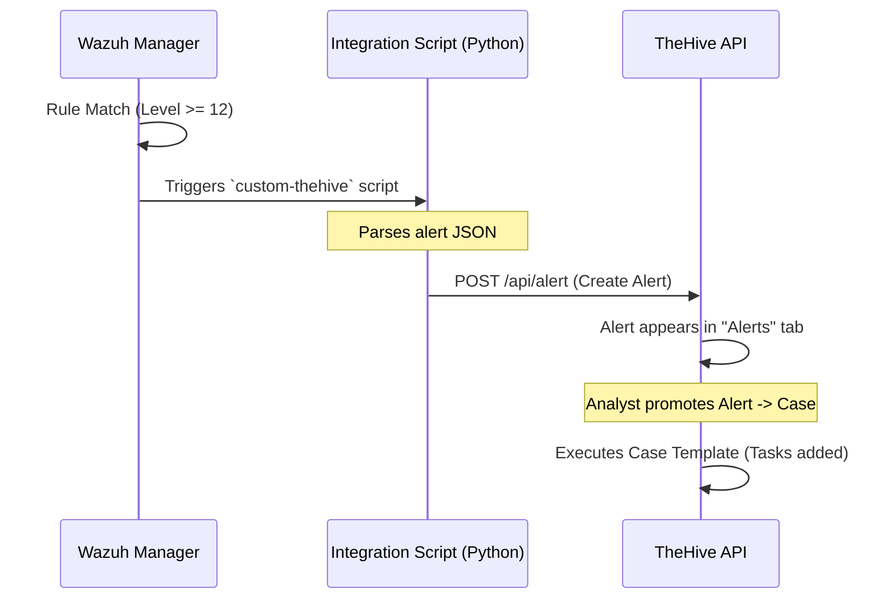

# Phase 4 — Incident Response Workflow

## What Is This Phase?

This phase connects your **detection engine** (Wazuh) to your **incident response platform** (TheHive). Instead of just generating alerts that scroll by on a dashboard, we automate the creation of **Cases** for high-severity threats. This ensures every critical alert is tracked, investigated, and resolved according to a standard process.

## Why Are We Implementing This?

| Reason | Explanation |
|---|---|
| **Alert Fatigue** | SOC analysts can't watch a scrolling log of alerts all day. We need a system to capture and organize the important ones |
| **Accountability** | An alert in a log file can be ignored. A case in TheHive behaves like a ticket — it must be assigned, investigated, and closed |
| **Standardization** | Incident response requires following a process (NIST/SANS). TheHive enforces this via **Case Templates** (e.g., "Phishing Playbook") |
| **Automation** | By auto-creating cases, we save time and ensure no critical threat is missed (e.g., at 3 AM) |
| **Interview Value** | Shows you understand **SOAR** (Security Orchestration, Automation, and Response) concepts |

## The Integration Logic



## How to Implement

### Step 1 — Get TheHive API Key

1. Log in to TheHive (`http://localhost:9000`)
2. Go to **Organization** > **Users**
3. Create a user named `wazuh` (Role: `analyst`)
4. Click "Create API Key" for this user
5. **Copy the API key** — you'll need it for the integration script

### Step 2 — Create the Integration Script

Wazuh needs a script to talk to TheHive. Create `/var/ossec/integrations/custom-thehive.py` on the Wazuh Manager container:

```python
#!/usr/bin/env python3
import sys
import json
import requests
import time

# Configuration (K8s Service DNS)
# Format: http://<service-name>.<namespace>.svc.cluster.local:<port>
THEHIVE_URL = "http://thehive.soc.svc.cluster.local:9000"
THEHIVE_API_KEY = "YOUR_API_KEY_HERE"

def send_alert(alert_json):
    # Parse Wazuh alert
    alert = json.loads(alert_json)
    
    # Check minimum severity (level >= 10)
    if alert['rule']['level'] < 10:
        return

    # Extract fields
    rule_id = alert['rule']['id']
    description = alert['rule']['description']
    agent_name = alert['agent']['name']
    agent_ip = alert['agent'].get('ip', 'n/a')
    mitre_tech = alert['rule'].get('mitre', {}).get('id', [])
    
    # Map MITRE IDs to tags
    tags = ["wazuh"]
    if isinstance(mitre_tech, list):
        tags.extend(mitre_tech)
    elif isinstance(mitre_tech, str):
        tags.append(mitre_tech)

    # Create TheHive Alert Artifact
    observables = []
    if agent_ip != 'n/a':
        observables.append({'dataType': 'ip', 'data': agent_ip, 'message': 'Source IP'})
    
    # Build Alert JSON
    thehive_alert = {
        'title': f"Wazuh Alert: {description}",
        'description': f"**Rule ID:** {rule_id}\n**Agent:** {agent_name} ({agent_ip})\n**Full Log:**\n```{json.dumps(alert, indent=2)}```",
        'type': 'external',
        'source': 'wazuh',
        'sourceRef': f"wazuh-{alert['id']}",
        'severity': 3 if alert['rule']['level'] >= 12 else 2,
        'tags': tags,
        'artifacts': observables
    }

    # Send to TheHive
    headers = {'Authorization': f"Bearer {THEHIVE_API_KEY}", 'Content-Type': 'application/json'}
    try:
        response = requests.post(f"{THEHIVE_URL}/api/alert", headers=headers, json=thehive_alert, timeout=10)
        response.raise_for_status()
    except Exception as e:
        with open("/var/ossec/logs/integrations.log", "a") as f:
            f.write(f"Error sending to TheHive: {e}\n")

if __name__ == "__main__":
    # Wazuh passes alert file path as 1st argument
    alert_file = sys.argv[1]
    with open(alert_file) as f:
        alert_json = f.read()
    send_alert(alert_json)
```

> **Note:** Make sure to `chmod +x /var/ossec/integrations/custom-thehive.py` and `chown root:wazuh /var/ossec/integrations/custom-thehive.py` inside the container.

### Step 3 — Enable Integration in Wazuh

Edit `/var/ossec/etc/ossec.conf` on the Wazuh Manager to enable the script:

```xml
<ossec_config>
  <integration>
    <name>custom-thehive</name>
    <hook_url>http://thehive.soc.svc.cluster.local:9000</hook_url> <!-- Not used by script but required by schema -->
    <level>10</level>  <!-- Only alerts level 10+ trigger integration -->
    <alert_format>json</alert_format>
  </integration>
</ossec_config>
```

Restart Wazuh Manager:
`docker-compose restart wazuh.manager`

### Step 4 — Define Case Templates in TheHive

Case templates standardized how you respond.

1. **Log in to TheHive**
2. Go to **Organization** > **Case Templates** > **Create Template**
3. **Name:** `Brute Force Response`
4. **Tasks:** Add the following tasks:
   - [ ] **Triage:** Confirm if source IP is internal or known malicious
   - [ ] **Containment:** Block source IP on firewall / Isolate host
   - [ ] **Investigation:** Check if any login was successful (Event 4624)
   - [ ] **Remediation:** Reset user password if compromised
   - [ ] **Closure:** Document findings and close case

### Step 5 — Verify the Workflow

1. Trigger a test alert (e.g., generate failed logins on a Windows agent).
2. The Wazuh rule should fire (Level 10+).
3. Check `/var/ossec/logs/integrations.log` for success messages.
4. Go to TheHive > **Alerts** tab.
5. You should see "Wazuh Alert: Brute force attack detected...".
6. Click **Import** to turn it into a Case.
7. Select the `Brute Force Response` template.
8. You now have a structured case with tasks ready for an analyst!

## Common Issues

| Issue | Cause | Fix |
|---|---|---|
| No alerts in TheHive | Script permission denied | `chmod 750 custom-thehive.py`, `chown root:wazuh` |
| "Connection Refused" | Script using `localhost` instead of docker name | Use `http://thehive:9000` inside the script |
| Authentication Error | Wrong API key | Regenerate API key in TheHive and update script |
| Missing Libraries | `requests` module not in container | Run `pip install requests` inside Wazuh container (and add to Dockerfile for persistence) |

## What Success Looks Like

- ✅ High-severity Wazuh alerts automatically appear in TheHive's "Alerts" list
- ✅ Alerts contain the source IP, agent name, and MITRE tags
- ✅ You can convert an Alert to a Case with one click
- ✅ The Case has the correct Tasks from your template

## What's Next?

→ **Phase 5** — Build the ultimate visual dashboard in Grafana to see all this data moving in real-time.
