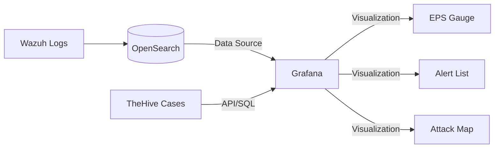

# Phase 5 — Security Dashboard (Grafana)

## What Is This Phase?

This phase builds the **Main Intelligence Dashboard** for your SOC. While Wazuh has built-in dashboards, Grafana lets you combine data from multiple sources (Wazuh, TheHive, Infrastructure) into a single operational view. You will create panels tracking **EPS**, **Top Attacks**, **Geolocation**, and **Incident Status**, giving you the "big picture" visibility needed for real-time monitoring.

## Why Are We Implementing This?

| Reason | Explanation |
|---|---|
| **Centralized Visibility** | See everything in one place — logs, alerts, server health, and open cases |
| **Operational Metrics** | Track KPIs like EPS (Events Per Second) and Mean Time To Respond (MTTR) which aren't in Wazuh by default |
| **Customizability** | Wazuh dashboards are rigid. Grafana lets you query OpenSearch directly for *anything* you want |
| **Wow Factor** | A live, scrolling Grafana dashboard with maps and gauges is the most visually impressive part of a SOC project |
| **Interview Value** | Shows you know how to query data (Lucene/KQL) and visualize it for stakeholders |

## Dashboard Architecture



## How to Implement

### Step 1 — Configure OpenSearch Data Source

1. Log in to Grafana (`http://localhost:3000`)
2. Go to **Connections** > **Data Sources** > **Add data source**
3. Select **OpenSearch**
4. **URL:** `https://wazuh-indexer.soc.svc.cluster.local:9200`
5. **Auth:** Basic Auth
   - User: `admin`
   - Password: `YourSecretPassword` (from .env)
6. **TLS/SSL Auth Details:**
   - Enable "Skip TLS Verify" (for lab environment with self-signed certs)
7. **Index Name:** `wazuh-alerts-*`
8. **Time Field:** `timestamp`
9. **Version:** OpenSearch 2.x
10. Click **Save & Test** — "Data source is working"

### Step 2 — Create the "SOC Main View" Dashboard

Create a new Dashboard and add these panels:

#### Panel 1: Security Events Per Second (EPS)
- **Visualization:** Time Series or Gauge
- **Query:** `Count` of documents where `rule.level >= 1`
- **Group By:** `Date Histogram (1s)`
- **Title:** "Real-Time Ingestion (EPS)"
- **Why:** Shows if logs are flowing or if there's a huge spike (DDoS/flood).

#### Panel 2: Threat Severity Breakdown
- **Visualization:** Pie Chart
- **Query:** Terms aggregation on `rule.level` or `rule.groups`
- **Title:** "Alerts by Severity"
- **Why:** Quick view of the threat landscape — are we seeing mostly low-level noise or critical attacks?

#### Panel 3: Top Attacking MITRE Techniques
- **Visualization:** Bar Gauge (Horizontal)
- **Query:** Terms aggregation on `rule.mitre.tactic`
- **Title:** "Top MITRE Tactics Detected"
- **Why:** Shows *what* attackers are trying to do (e.g., 50% Credential Access, 20% Discovery).

#### Panel 4: GeoIP Attack Map
- **Visualization:** Geomap
- **Query:** Geohash aggregation on `data.geoip.location`
- **Title:** "Source IP Location"
- **Why:** Visualizes where attacks are coming from (Country/City).

#### Panel 5: Recent High-Severity Alerts
- **Visualization:** Logs or Table
- **Query:** `rule.level >= 10`
- **Fields:** `timestamp`, `agent.name`, `rule.description`, `data.srcip`
- **Title:** "Critical Alerts Stream"
- **Why:** The "live feed" of things that need immediate attention.

### Step 3 — Advanced: TheHive Case Status (Optional)
Connect Grafana to TheHive's Cassandra (using a plugin) or PostgreSQL (if you used PG) or use a simple API script to push metrics to InfluxDB/Prometheus. Since we're keeping it simple:
- Use **Wazuh Alerts** as a proxy for cases (Count of `rule.level >= 12`).

## Provisioning Dashboards (Automation)

To avoid creating this manually every time, save the dashboard JSON and mount it in Docker:

```yaml
# docker-compose.yml snippet for Grafana
volumes:
  - ./grafana/dashboards:/var/lib/grafana/dashboards
  - ./grafana/provisioning:/etc/grafana/provisioning
```

**`provisioning/dashboards/dashboard.yml`:**
```yaml
apiVersion: 1
providers:
  - name: 'SOC Dashboards'
    orgId: 1
    folder: ''
    type: file
    disableDeletion: false
    updateIntervalSeconds: 10
    options:
      path: /var/lib/grafana/dashboards
```

## What Success Looks Like

- ✅ Dashboard loads with 5+ panels populated with data
- ✅ EPS Gauge moves in real-time as you generate logs
- ✅ Attack Map shows dots when you simulate traffic from different IPs
- ✅ Clicking a bar in the "MITRE Tactics" chart filters the "Critical Alerts" down to just those events

## What's Next?

→ **Phase 6** — The final step: Simulate attacks to light up this dashboard and prove the SOC works!
