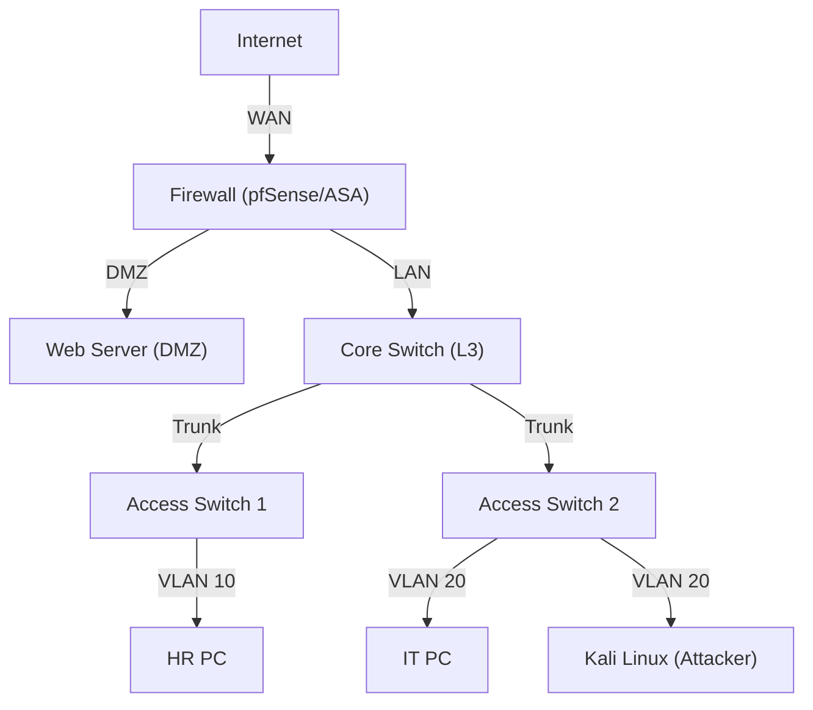

# Phase 1 — Lab Environment Setup (Cisco Packet Tracer)

## What Is This Phase?
This phase involves building the **virtual network lab** that will serve as the foundation for all subsequent troubleshooting and security analysis tasks. We will create a realistic enterprise topology featuring a Firewall (pfSense/Cisco ASA), a Core Switch, Access Switches, and endpoint machines (Windows/Linux VMs).

## Why Are We Implementing This?

| Reason | Explanation |
|---|---|
| **Safe Sandbox** | Perform destructive tests (breaking routing, blocking ports) without affecting a real network |
| **Realistic Complexities** | A simple flat network won't teach you VLANs or routing. We need a multi-segment network |
| **Tool Familiarity** | Packet Tracer is an industry-standard simulation tool used for CCNA/CCNP certification |
| **Foundation** | You can't troubleshoot "broken connectivity" if you haven't first built a working network |

## Lab Topology Design

We will implement a **3-Tier Architecture** (simplified):



## How to Implement

### Implementation Strategy: Cisco Packet Tracer
**Requirements:** Packet Tracer 8.x (Free from Cisco NetAcad).
1. **Drag & Drop Devices:**
   - 1x ISR 4331 Router (Edge)
   - 1x ASA 5506-X Firewall (Security)
   - 1x 3560 Multilayer Switch (Core)
   - 2x 2960 Switches (Access)
   - 3x PCs, 1x Server
2. **Cabling:** Use Straight-through for device-to-switch, Crossover for switch-to-switch.

### Step-by-Step Implementation Strategy

#### Step 1: Physical Connectivity (L1)
- Connect Cloud/NAT node to Firewall WAN port.
- Connect Firewall LAN port to Core Switch.
- Connect Core Switch to Access Switches.
- Connect Endpoints to Access Switches.
- **Verification:** Ensure link lights are green (or green/amber for STP).

#### Step 2: Basic IP Addressing (L3)
Define subnets:
- **WAN:** DHCP (from ISP/Home Network)
- **DMZ:** `192.168.10.0/24`
- **LAN Management:** `192.168.20.0/24`
- **User VLAN 10:** `192.168.30.0/24`
- **User VLAN 20:** `192.168.40.0/24`

#### Step 3: Initial Device Config
On Cisco devices (CLI):
```cisco
enable
configure terminal
hostname Core-Switch
interface vlan 1
 ip address 192.168.20.2 255.255.255.0
 no shutdown
exit
ip default-gateway 192.168.20.1
```

## What Success Looks Like
- ✅ All devices are powered on and connected.
- ✅ You can ping the default gateway from the Core Switch.
- ✅ Packet Tracer project file is saved and stable.
- ✅ Topology diagram matches the implementation.

## What's Next?
→ **Phase 2:** We will break things! We'll configure VLANs and simple routing, then introduce "tickets" (simulated faults) to troubleshoot.
