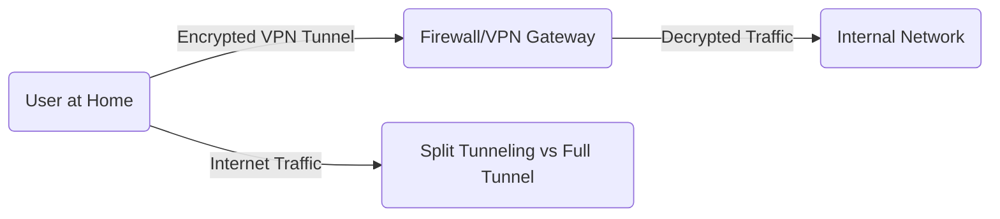

# Phase 5 — VPN & Remote Access Scenarios

## What Is This Phase?
This phase focuses on enabling secure **Remote Access**. We will configure a **Remote Access VPN** (Virtual Private Network) to allow external users (simulated home workers) to securely connect to the internal LAN resources. We'll troubleshoot common issues like split tunneling, authentication failures, and blocked protocols (GRE/ESP).

## Why Are We Implementing This?

| Reason | Explanation |
|---|---|
| **Modern Workforce** | With remote/hybrid work, VPN troubleshooting is the #1 ticket type for many IT support teams (20-30% of incidents). |
| **Encryption/Tunneling** | Understanding how encapsulation (IPSec/SSL) works is fundamental to network security. |
| **Authentication** | Integrating VPN with Radius/Active Directory (or local database) teaches Identity & Access Management (IAM). |
| **Policy Control** | Learning to restrict *what* remote users can access (simulating "Zero Trust"). |

## VPN Architecture

## How to Implement

### Option A: OpenVPN (Recommended for pfSense/Linux)
OpenVPN is the industry standard for SSL VPNs.
1. **Server Setup:** Configure OpenVPN Server on pfSense/Linux.
   - Protocol: UDP 1194 (Default).
   - Encryption: AES-256-GCM.
   - Auth: Local Database (Certificates + User/Pass).
   - Tunnel Network: `10.0.8.0/24`.
2. **Client Config:** Export `.ovpn` profile.
3. **Endpoint:** Import profile into OpenVPN Connect client on Windows/Linux VM.

### Option B: IPSec (Recommended for Cisco ASA)
Standard for site-to-site and legacy client VPNs.
1. **IKEv1/IKEv2 Policy:** Encryption (AES), Hash (SHA), Auth (Pre-Shared Key/Cert), Group (DH Group 14).
2. **Transform Set:** IPSec Encryption/Hash for data payload.
3. **Crypto Map:** Bind policy to the outside interface.
4. **AnyConnect:** Configure SSL VPN if using Cisco AnyConnect.

## Troubleshooting Scenarios

### Scenario 1: "VPN Connects but No Internal Access" (Routing/NAT)
**Simulation:** VPN client gets IP `10.0.8.2`, but cannot ping LAN Server `192.168.20.10`.
**Causes:**
- **Missing Route:** Firewall doesn't know how to route `10.0.8.0/24`.
- **NAT Issue:** Outbound NAT not configured for VPN subnet.
- **Firewall Rule:** Blocked traffic from OpenVPN interface to LAN net.
**Fix:**
1. Check Routing Table on Firewall (`netstat -rn`).
2. Verify Firewall Rules on OpenVPN tab (Allow Any to LAN).
3. Verify NAT outbound rules include VPN network.

### Scenario 2: "Connection Refused / Timeout" (Port Blocked)
**Simulation:** Block UDP 1194 on the WAN interface.
**Symptoms:** Client says "Waiting for Server..." forever.
**Fix:** Allow UDP 1194 on WAN firewall rule.

### Scenario 3: "DNS Failures over VPN" (Split DNS)
**Simulation:** User can access `192.168.20.10` but not `intranet.corp`.
**Cause:** VPN not pushing internal DNS server (`192.168.20.1`). Client uses home ISP DNS (`8.8.8.8`) which can't resolve internal names.
**Fix:** Configure VPN Server to "Push DNS" -> `192.168.20.1`.

### Scenario 4: "Slow Performance / Packet Loss" (MTU Issues)
**Simulation:** Set MTU too high on VPN interface (fragmentation).
**Symptoms:** Web pages load halfway then hang; SSH works but `cat largefile` freezes.
**Fix:** Lower MSS (Maximum Segment Size) or MTU (try `1300` bytes).

## What Success Looks Like
- ✅ Remote user can connect to VPN successfully.
- ✅ Remote user receives an IP from the VPN pool (`10.0.8.x`).
- ✅ Remote user can RDP/SSH into internal servers.
- ✅ Remote user can resolve internal DNS names (if configured).
- ✅ Traffic is encrypted (Wireshark on WAN interface shows only UDP 1194 payload, no readable data).

## What's Next?
→ **Phase 6:** The final step! We'll wrap everything up into professional **Documentation & Reporting**, simulating how you'd close tickets and present findings to management.
