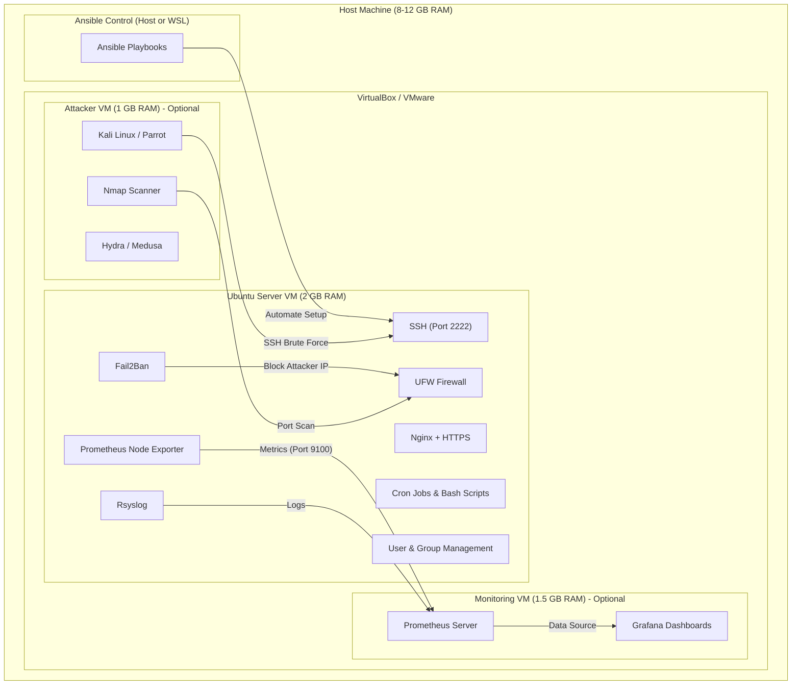

# Project 2: Linux Server Administration, Network Monitoring & Security

> **An all-rounder infrastructure project** designed to demonstrate real-world skills for **IT Support**, **SysAdmin**, and **DevOps** roles.

## 🏗️ Architecture Overview



## 🖥️ Tech Stack

| Tool | Purpose | Role Relevance |
|---|---|---|
| **Ubuntu Server 22.04** | Base operating system | IT Support, SysAdmin |
| **SSH (OpenSSH)** | Remote access (custom port 2222) | IT Support, SysAdmin |
| **UFW** | Firewall management | IT Support, SysAdmin |
| **Nginx** | Web server + reverse proxy + HTTPS | SysAdmin, DevOps |
| **Fail2Ban** | Intrusion prevention | SysAdmin, Security |
| **Prometheus + Node Exporter** | Metrics collection & monitoring | DevOps, SysAdmin |
| **Grafana** | Visualization dashboards | DevOps, SysAdmin |
| **Rsyslog / Journald** | Centralized logging | SysAdmin, IT Support |
| **Bash Scripting** | Automation (health checks, backups) | All roles |
| **Ansible** | Configuration management & IaC | DevOps, SysAdmin |
| **Nmap / Hydra** | Security auditing & testing | Security, SysAdmin |

## 🖥️ Lab Setup Options (How many VMs do I need?)

You can choose one of these three setups based on your available RAM. **The "Minimal" setup is sufficient to complete the project.**

### Option 1: Minimal (Recommended for < 8GB RAM)
**Total VMs:** 1
**RAM Required:** ~2 GB
-   **VM 1 (The Server):** Runs *everything* — Ubuntu, Nginx, Prometheus, Grafana, and Docker.
-   **Attacker:** You use your **Host Machine** (Windows PowerShell or WSL) to run Nmap/Hydra attacks against the VM.
-   **Why this works:** It saves resources. The only downside is you don't simulate "remote" monitoring, but the skills learned are identical.

### Option 2: Standard (Realistic Monitoring)
**Total VMs:** 2
**RAM Required:** ~3.5 GB
-   **VM 1 (Target Server):** Runs the services (Nginx, SSH).
-   **VM 2 (Monitoring Server):** Runs Prometheus & Grafana.
-   **Why:** In the real world, you **never** put your monitoring tool on the same server it's monitoring. If the server crashes, your monitoring goes down with it! Examples: Separate Server, Cloudwatch, Datadog.

### Option 3: Full Lab (Real-World Network Simulation)
**Total VMs:** 3
**RAM Required:** ~4.5 GB
-   **VM 1 (Target Server):** The "Victim". Runs Nginx, SSH.
-   **VM 2 (Monitoring Server):** Runs Prometheus/Grafana.
-   **VM 3 (Attacker - Kali/Parrot):** A dedicated hacking machine.
-   **Why:**
    1.  **Network Isolation:** You can test firewall rules effectively (e.g., "Block VM 3 but allow VM 2").
    2.  **True Simulation:** Simulates an external threat actor (Kali) vs. an internal monitoring system (Prometheus).
    3.  **Tools:** Kali comes pre-installed with Hydra, Nmap, Metasploit, saving you install time.

> **💡 My Advice:** Start with **Option 1 (Minimal)**. If you have extra RAM and want to practice firewall rules between machines, upgrade to Option 3 later.

## 📂 Project Structure

```
project_2/
├── README.md
├── docs/                          ← Phase-by-phase documentation
│   ├── phase1-server-deployment.md
│   ├── phase2-network-services.md
│   ├── phase3-security-incident-sim.md
│   ├── phase4-automation.md
│   ├── phase5-centralized-logging.md
│   └── phase6-documentation-reports.md
├── scripts/                       ← Bash automation scripts
│   ├── server-hardening.sh
│   ├── health-check.sh
│   ├── backup.sh
│   └── user-audit.sh
├── ansible/                       ← Ansible playbooks & inventory
│   ├── inventory.ini
│   ├── deploy-all.yml
│   ├── playbook-hardening.yml
│   ├── playbook-monitoring.yml
│   └── playbook-nginx.yml
├── configs/                       ← Reference configuration files
│   ├── sshd_config
│   ├── nginx.conf
│   ├── ufw-rules.txt
│   └── prometheus.yml
└── reports/                       ← Sample incident & health reports
    ├── incident-report-ssh-bruteforce.md
    └── monthly-health-report.md
```

## 📋 Phases

| # | Phase | Focus Area |
|---|---|---|
| 1 | [Server Deployment & Hardening](docs/phase1-server-deployment.md) | OS install, SSH, firewall, users |
| 2 | [Network Services & Monitoring](docs/phase2-network-services.md) | Nginx, HTTPS, DNS, port monitoring |
| 3 | [Security Incident Simulation](docs/phase3-security-incident-sim.md) | Brute-force sim, Fail2Ban, log analysis |
| 4 | [Automation](docs/phase4-automation.md) | Bash scripts + Ansible playbooks |
| 5 | [Centralized Logging & Dashboards](docs/phase5-centralized-logging.md) | Prometheus, Grafana, Rsyslog |
| 6 | [Documentation & Reports](docs/phase6-documentation-reports.md) | Incident reports, runbooks |
| 7 | [Ticketing & User Support](docs/phase7-ticketing-scenarios.md) | Spiceworks/Jira setup, Password resets, Permissions |

## 🎯 Role Relevance Matrix

| Phase | IT Support ✅ | SysAdmin ✅ | DevOps ✅ |
|---|---|---|---|
| Phase 1 | OS troubleshooting, SSH | Hardening, policies | Infra setup |
| Phase 2 | Port diagnostics | Nginx, HTTPS, DNS | Service deployment |
| Phase 3 | Log analysis | Fail2Ban, firewall | Security automation |
| Phase 4 | Basic scripting | Cron, backups | Ansible, IaC |
| Phase 5 | Service checks | Centralized logging | Prometheus + Grafana |
| Phase 6 | Incident reports | Runbooks | Post-mortems |

## 🚀 Getting Started

1. **Set up VirtualBox** — Download and install [VirtualBox](https://www.virtualbox.org/)
2. **Download Ubuntu Server 22.04** — [Ubuntu ISO](https://ubuntu.com/download/server)
3. **Follow Phase 1** — [Server Deployment & Hardening](docs/phase1-server-deployment.md)
4. **Work through each phase** sequentially — each builds on the previous

> [!NOTE]
> This project is designed to run entirely on a machine with **8 GB RAM**. All VM sizes are optimized for low-resource environments.
